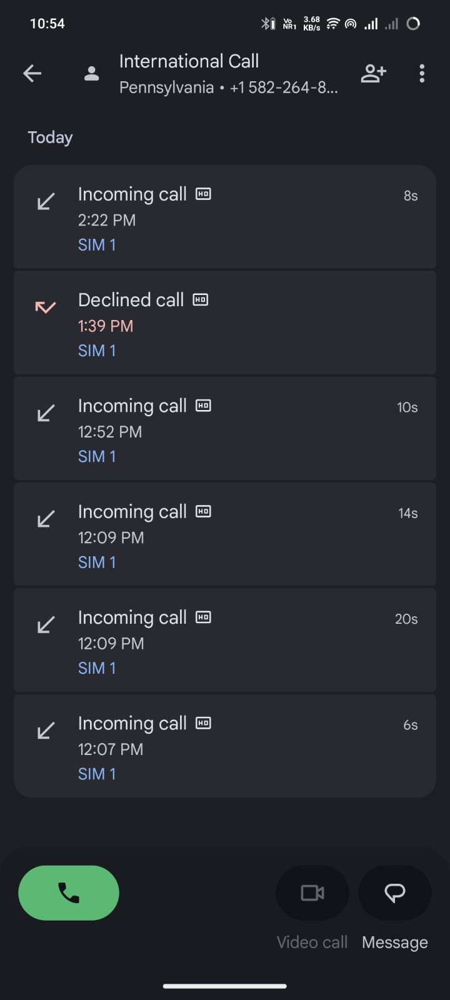
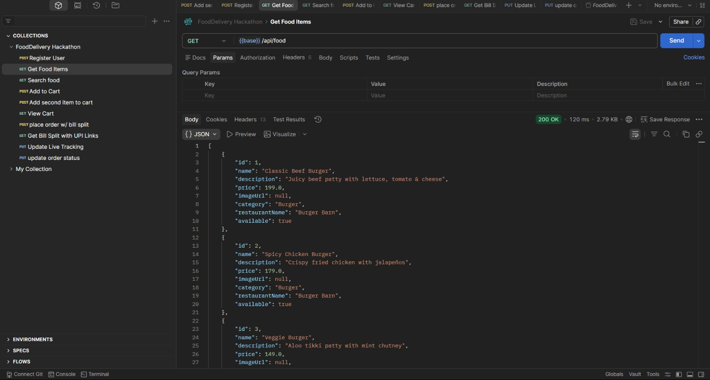
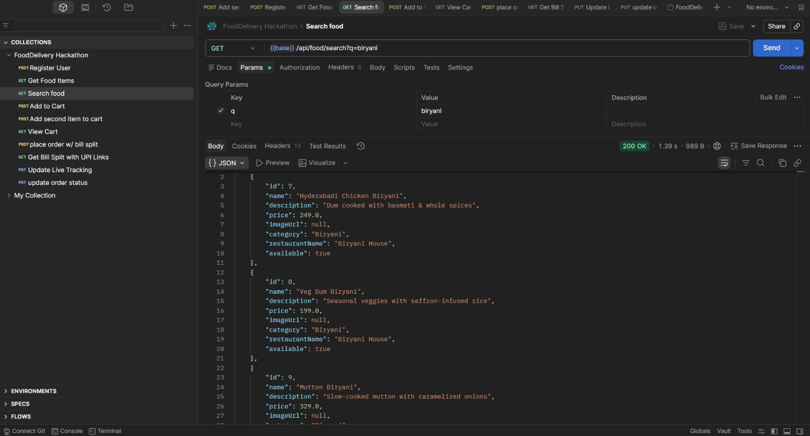
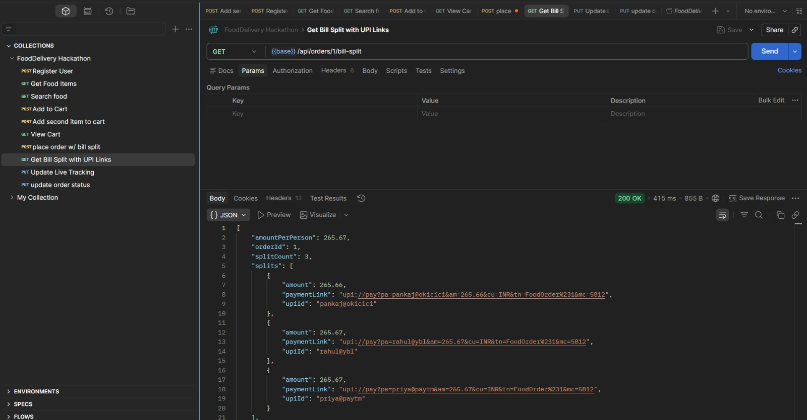
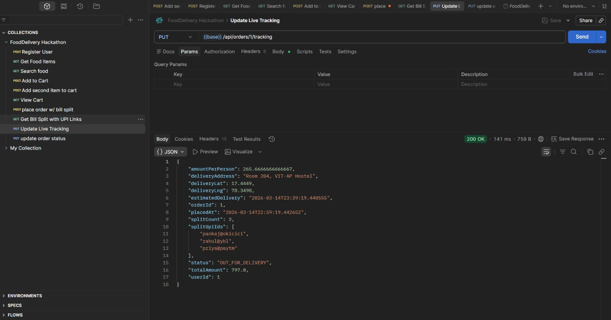
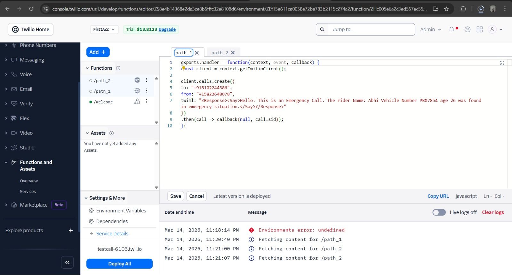
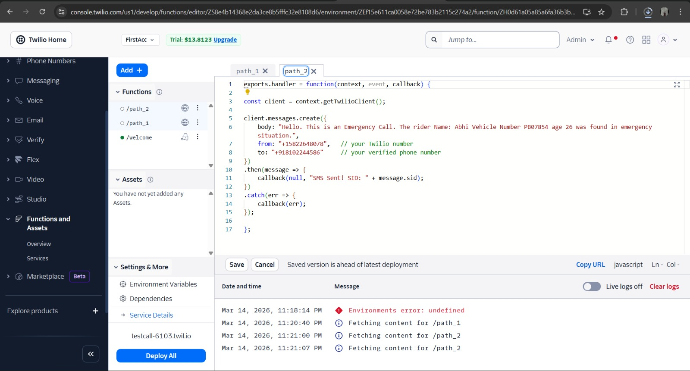

# 🍅 Tomato – Smart Food Delivery App

## 🚀 Overview
**Tomato** is a modern food delivery mobile application built during a hackathon to demonstrate a complete **end-to-end food ordering experience** combined with **AI-powered safety features for delivery partners**.

The platform allows users to browse restaurants, order food, split bills with friends, and track deliveries.  
In addition, Tomato introduces a **Delivery Partner Safety System** that uses **mobile sensors and machine learning to detect accidents** and automatically notify emergency contacts.

---

# 📱 Application Features

## 🍽 Food Ordering
- Login / Signup
- Restaurant browsing
- Menu with food categories
- Add items to cart
- Razorpay payment integration
- Order confirmation screen
- Delivery tracking screen

---

## 💸 Smart Bill Splitting

Tomato introduces **group ordering functionality** where friends can split the bill easily.

### Equal Split
Divide the bill equally among friends.

Example:

Total Bill: ₹600  
Friends: 3  
Each Pays: ₹200  

---

### Item-Wise Split
Assign food items to specific friends.

Example:

Burger → Friend 1  
Pizza → Friend 2  
Coke → Friend 3  

Friend 1 pays ₹120  
Friend 2 pays ₹250  
Friend 3 pays ₹90  

---

### Additional Split Features
- Add **UPI IDs**
- Share split payment details
- Send notifications for split requests

---

# 🛡 Delivery Partner Safety System (Core Innovation)

Food delivery riders frequently face safety risks while traveling long distances and navigating heavy traffic.

Tomato introduces an **AI-powered accident detection system** to improve delivery partner safety.

This feature detects potential accidents using **mobile sensors and machine learning**, and automatically alerts emergency contacts.

---

# ⚙ How the Safety System Works

The delivery partner's smartphone continuously reads motion data using built-in sensors:

- Accelerometer
- Gyroscope

These sensors capture:

- Sudden jerks
- Rapid angle changes
- Unusual motion patterns

The sensor data is processed by a **Machine Learning model** trained to detect accident-like motion patterns.

---

# 🧠 Accident Detection Logic

The ML model analyzes parameters such as:

- Sudden **high acceleration spikes**
- Rapid **rotation angle changes**
- Unusual **device orientation shifts**
- Impact-like motion patterns

If these signals cross a predefined threshold, the system flags a **possible accident event**.

---

# 📞 Emergency Response System

Once an accident is detected, the system automatically triggers emergency alerts.

## Step 1 — Automated Phone Call

Using **Twilio API**, the application automatically calls a pre-verified emergency contact number.

Example automated message:

> "Emergency alert from Tomato delivery system. A possible accident has been detected. Please check on the delivery partner immediately."

---

## Step 2 — Emergency SMS with Live Location

An SMS message is sent simultaneously containing:

- Accident alert
- Delivery partner details
- Live GPS location

Example message:

🚨 Emergency Alert – Tomato Delivery Partner  

A possible accident has been detected.

Delivery Partner: Rahul  
Location: https://maps.google.com/?q=28.6139,77.2090  

Please check immediately.

## 📱 App Screenshots

  

  

  

## 📱 Backend Screenshots

## Emergency Calling System

---

# 🛠 Technology Stack

## Mobile Application
- Kotlin
- Jetpack Compose
- Android Sensors API
- Razorpay Payment SDK
- Firebase Notifications

## Backend
- Java
- Spring Boot
- REST APIs

## Safety System
- Machine Learning Model
- Accelerometer + Gyroscope data
- GPS location services

## Communication
- Twilio API
  - Automated voice calls
  - SMS alerts

---

# 🎯 Hackathon Impact

Tomato focuses on solving **two real-world problems**:

1️⃣ Making group food ordering easier through **smart bill splitting**

2️⃣ Improving **delivery partner safety** through **sensor-based accident detection**

Most food delivery apps focus only on customer convenience, while Tomato adds an additional layer of **worker safety and emergency response automation**.

---

# 🔮 Future Improvements

- Real-time GPS delivery tracking
- Rider health monitoring
- Crash severity prediction using ML
- Integration with emergency services
- Restaurant onboarding system

---

# 🏁 Conclusion

Tomato demonstrates how a food delivery platform can evolve beyond traditional ordering systems by incorporating **AI-based safety mechanisms** and **smart group ordering features**.

The project highlights how modern technologies such as **mobile sensors, machine learning, and automated communication systems** can improve both **customer experience and delivery partner safety**.

---

# 👨‍💻 Team
Built during a hackathon by a team passionate about:

- Mobile Development
- Backend Engineering
- Machine Learning
- Real-world problem solving

